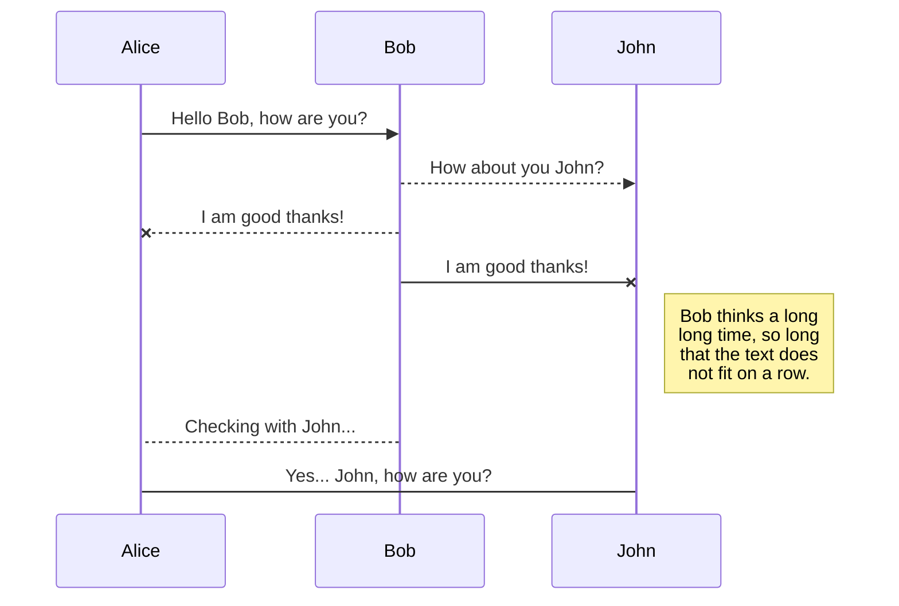

# GIS Enabled Municipality System

This was developed as part of my final year project at the <strong>Midlands State University</strong>

##### NOTE: This is only the Property Management Module

I lost the code for the Fault Reporting Module

##### Discusion

The main objective of this research was to develop a GIS enabled web based engineering service fault reporting system that will allow the citizenry to report engineering services faults in their neighborhood. Gweru City Council Engineering Department has been using a manual system where by the citizenry had to visit or call the city council every time they had an issue to report. This information is being stored in hard copy format which limits the analysis and visualization of the information. The manual system not only limits visualization and analysis but, it also doesn’t give value to the information reported because no insights can be derived from the data in hard copy format. Hard copy storage limits the potential of the city engineering department in attending to the reported faults. With the system that has been developed the citizenry can now report faults in a very efficient way. The system provides a precise way of pin pointing the exact location of a fault. The system also provides a tool that can assist in trip planning by providing driving routes from one point to the other allowing for effective resource usage. The system allows the city council to attend to faults that have been reported in near real-time as the system is accessible over mobile platforms. This means the team attending to faults in the field has no need to come back to the office to check in for other reported faults or faults that have been assigned as they can access the system on the go. The system provides an efficient way of attending to faults where by a supervisor assigns work to the teams responsible for attending faults on the ground. This also improves on resource deployment as a specific team can be assigned faults in a specific area or a specific type of faults in an area. For convenience and transparency, the system also allows the citizenry to check on the current status of the faults they have reported on.
Several existing fault reporting systems were reviewed aiding in the development of the GIS enabled web based engineering service fault reporting system. Existing systems mainly targeted cities that had fully developed land information datasets and thus citizenry could easily locate faults by mentioning the street names. However, thus not the case with Gweru and thus by providing a map based reporting solution, the system is of great convenience. Also it has been observed that other systems were only focused on reporting of the faults and not providing insights from the collected data. The developed prototype of the GIS enabled web based engineering service fault reporting system allows both the city and the citizenry to get insights of the data available in a simple and easy to understand manner. Existing systems required also require one with knowledge of the place they have seen a fault i.e. the street name. Also the procedures adopted in reporting require someone with some good background in working with computers. Since the research study area was Gweru, developing a similar system will cause the citizenry to resort back to calling or visit the council offices because of the system complexity. Because of this truth, the prototype was developed with simplicity as it incorporates a simple flow in reporting the faults. The City council personnel as well do not have that much expertise in GIS and so the system presents little or no challenge in all its operations. As mentioned afore, the system also provides easy to understand insights for performance measurement through a simple field team management module.

## Update a publication

After publishing, StackEdit keeps your file linked to that publication which makes it easy for you to re-publish it. Once you have modified your file and you want to update your publication, click on the **Publish now** button in the navigation bar.

> **Note:** The **Publish now** button is disabled if your file has not been published yet.

## Manage file publication

Since one file can be published to multiple locations, you can list and manage publish locations by clicking **File publication** in the **Publish** sub-menu. This allows you to list and remove publication locations that are linked to your file.

## UML diagrams

You can render UML diagrams using [Mermaid](https://mermaidjs.github.io/). For example, this will produce a sequence diagram:

And this will produce a flow chart:
